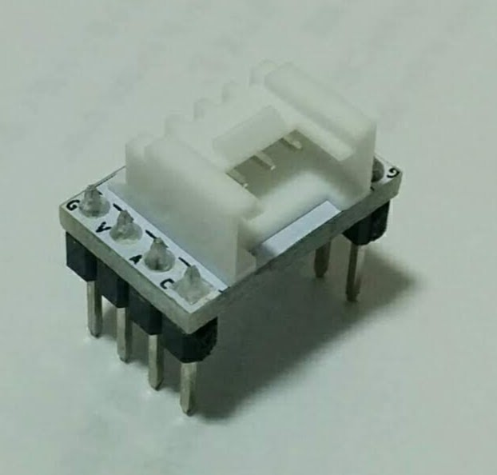

# grove-connector-breakout-board

Breakout boards to use grove connector on a bread board.


## Setup

This project use submodule so execute this command after cloning.

```
git submodule update --init --recursive
```

## horizontal-both-sides



## horizontal-one-line


## vertical-both-sides


## vertical-one-line


## References

- [Groveコネクタをブレッドボードで使うためのブレイクアウトボードを作ってみた](https://asukiaaa.blogspot.com/2020/12/grove-connector-breakout.html)
- [Grove System](https://wiki.seeedstudio.com/Grove_System/)
